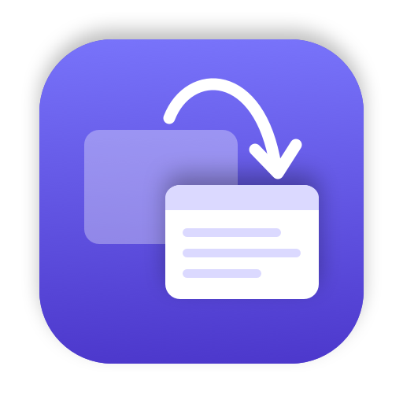

<p align="center">
  
</p>

<h1 align="center">Hop</h1>

<p align="center">A tiny ⌘Tab window switcher for macOS. It does one thing.</p>

<p align="center">
  
</p>

Hop replaces the built-in ⌘Tab app switcher with a list of **windows**, most recently used first, across all desktops.
It has no preferences window, doesn't take screenshots of your windows, has no dependencies, and is about 1,000 lines of Swift.

## Usage

| Keys | Action |
| --- | --- |
| **⌘Tab** | Open the switcher and move down. A quick tap jumps straight to the previous window. |
| **⌘⇧Tab**, **↑** / **↓** | Move up / down |
| Release **⌘**, **Return**, or click | Switch to the selected window |
| **Esc** | Cancel |
| Hold **⌃** | Show only windows on the current desktop (while held) |

Minimized windows, windows of hidden apps, and running apps with no windows are listed after your other windows.

The menu-bar icon has two settings: **Show Windows from All Desktops** (on by default; ⌃ flips it) and **Launch at Login**.

## Install

Hop is built from source. You need macOS 13 or later and Swift, which comes with Xcode or the Command Line Tools
(`xcode-select --install`).

```sh
git clone https://github.com/taltsi/hop.git
cd hop
scripts/setup-signing.sh   # optional, recommended: see below
./build.sh install         # builds, copies to ~/Applications and launches
```

On first launch, grant **Accessibility** access in System Settings → Privacy & Security → Accessibility.
Hop needs it to intercept ⌘Tab and to list and focus windows.

**Why `setup-signing.sh`?** macOS ties the Accessibility permission to the app's code signature. Without a signing certificate,
every build gets a different signature and you have to grant the permission again after each rebuild. The script creates
a self-signed certificate in its own keychain (`~/Library/Keychains/hop-signing.keychain-db`), and `build.sh` uses it automatically.
To remove it: `security delete-keychain ~/Library/Keychains/hop-signing.keychain-db`.

## How it works

- **Hotkey:** a session `CGEventTap` intercepts ⌘Tab. The system's own ⌘Tab is turned off while Hop runs and turned back on when it quits.
- **Window list:** windows on the current desktop come from the Accessibility API. Windows on other desktops aren't listed by that API,
  so Hop finds them in the background by probing each app's accessibility elements, and caches them by window id.
- **Order:** Hop watches focus changes in every app, so the list is ordered by when you last used each window, across all desktops.
- **Switching:** Hop brings the app forward with exactly the chosen window focused, switching desktops if needed.

## Caveats

- **Private APIs.** Hop uses undocumented macOS interfaces (SkyLight and private Accessibility functions) that no public API replaces.
  It looks them up at runtime and falls back to public APIs where it can. A future macOS update could still break parts of it,
  and it can never be in the Mac App Store.
- **Windows Hop hasn't seen yet.** A window that already existed on another desktop can take one ⌘Tab to appear,
  while Hop searches for it in the background.
- **Two processes.** Activity Monitor shows two Hop processes. The second is a tiny watchdog that turns the system ⌘Tab
  back on if Hop crashes or is force quit.

## Debugging

`~/Applications/Hop.app/Contents/MacOS/Hop --dump` prints the list Hop would show. ● marks windows on the current desktop.
Whatever runs this command (for example your terminal) needs Accessibility access.

## Acknowledgements

Hop exists thanks to the people who mapped out macOS's undocumented window interfaces in the open:

- [AltTab](https://github.com/lwouis/alt-tab-macos) showed that finding windows on other desktops by probing accessibility
  elements works.
- [yabai](https://github.com/koekeishiya/yabai) and the [Hammerspoon](https://github.com/Hammerspoon/hammerspoon) community
  documented the window-server calls used to focus a specific window.
- [Contexts](https://contexts.co) inspired the list-style design.

## License

[MIT](LICENSE)
